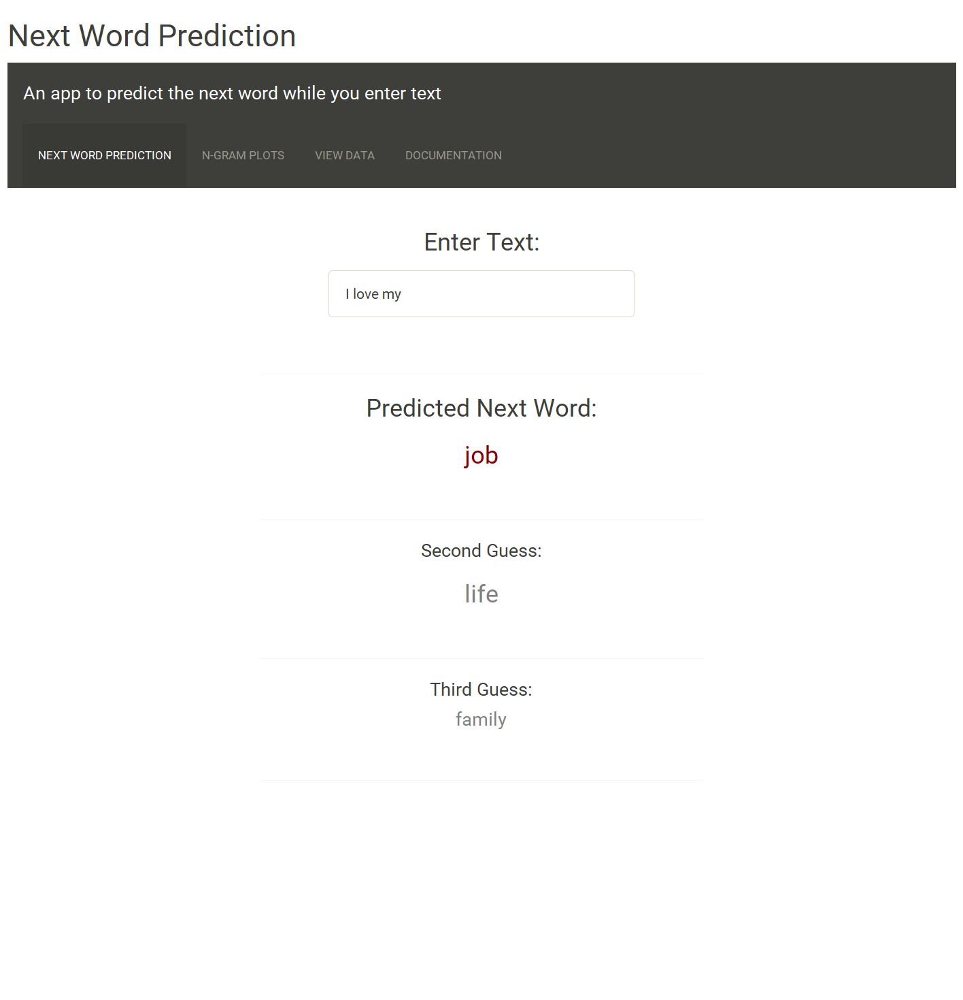

Coursera Data Science Capstone Project - Shiny App for Next Word Prediction Using N-Grams
========================================================
author: Sandile Tshazibana
date: August 8th, 2023
autosize: true

This Shiny app uses a basic n-gram model for predicting the next word based on the previous 1, 2, 3 or 4 words, using 1-grams, 2-grams, 3-grams, 4-grams and 5-grams.
This is the capstone project for the Coursera Data Science Specialization done by the Johns Hopkins University in collaboration with SwiftKey.

Summary
========================================================

English text data from 3 different sources: Blogs, Twitter & News were used in this project. The data were sampled, preprocessed and tokenized using well known R-text mining packages. 

A "next word prediction" model was developed by optimizing accuracy and efficiency. A simple "backoff model" was used to handle the words that may not be in the corpora. If there is no suggestion for the next word using 5-Grams (using last 4 words), then use 4-Grams, if not 3-grams, if not 2-Grams. Finally, if still not, use the highest probability  1-Gram word: "the". The model also calculates a second guess and a third guess.

[Shiny interactive app]() was developed and launched in Shinyapps.io. It predicts the next word, 2nd guess and 3rd guess when user enters words. Also displays the plots and data of n- grams as selected by the user.

How Does the App Work?
========================================================

***
As the user enters text in the given box, the next word, 2nd guess and 3rd guess predictions are displayed.
In the tab "N-GRAM PLOTS", user can select which n-gram to view from a drop down menu and the number of terms to display with a slider bar. In the tab "VIEW DATA", user can select which n-gram data to view from a drop down menu. The R package `DT` is used to create a data table from a R data frame. "DOCUMENTATION" tab contains a description about the app.

Highlights
========================================================

- The model performs with good accuracy. Large number of n-grams extracted and the use of a backoff model to predict the next word were helpful in building an accurate model.
- The speed of the model is excellent. It is able to predict the next word while the user is typing the text.
- R's package 'ngram' is used to tokenize the data.
- The words coming from foreign languages are handled by removing non-ascii characters.
- Profanity words, URLs, hash tags and Twitter handlers were removed from the corpora.

Useful Links
========================================================

- [Milestone Report](https://rpubs.com/nethika/milestone_report) for the first phase of the project.
- [Shiny Interactive App](https://nethika.shinyapps.io/Shiney_App_Next_Word/)
- [Github Repo](https://github.com/Nethika/shiny_app_next_word_prediction)
- [Slide Deck](http://rpubs.com/nethika/predict_next_word) 
- [Coursera Data Science Specialization](https://www.coursera.org/specializations/jhu-data-science)
- Data Downloaded from: [Capstone Dataset](https://d396qusza40orc.cloudfront.net/dsscapstone/dataset/Coursera-SwiftKey.zip)
